# Design patterns ou patterns de conception


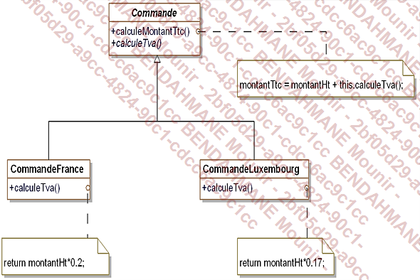


## Description des patterns 

- nom 
- description
- exemple de code sous forme de diagramme UML
- la structure standard (abstraite)
- un exemple de code 


## Cas concret d'etude pour ce cours 

Nous allons prendre en exemple le cas d'une societe qui vend des vehicules en ligne. 


## Premiere grande famille de design pattern : les patterns de construction 


### Le pattern Abstract Factory

Le but de ce pattern est de permettre de fabriquer des objets regroupes en "famille" sans avoir a connaitre les classes cibles destinee a la fabrication de ces objets 

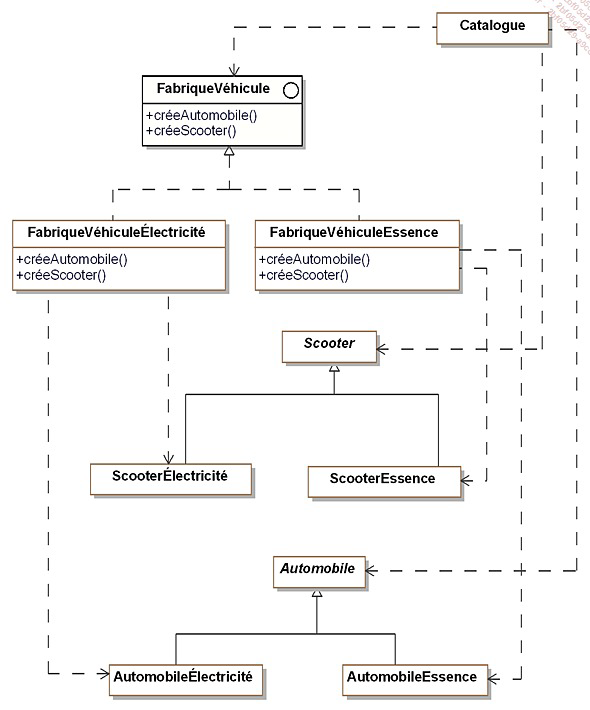


Petit rappel: 
``` 
dotnet new console -o
```

### Le pattern Builder 

Ce pattern permet d'abstraire la construction d'objets complexes de leur implementation de sorte qu'un client puisse creer des objets complexes sans avoir a se preocuper des differences d'implementation.


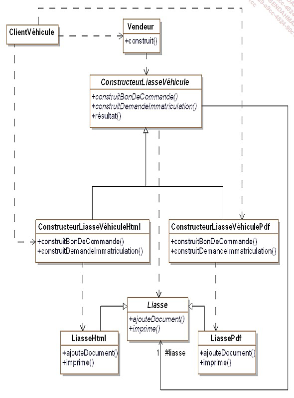


Pourquoi utiliser ce pattern : 
 - le client a besoin de construire des objets sans connaitre leur implementation
 - un client a besoin de construire des objets complexes ayant plusieurs representations ou implementations 


### Le pattern Factory Method 


Le but de ce pattern est d'introduire une methode abstraite de creation d'objet en reportant la aux sous-classes concretes la creation effective.


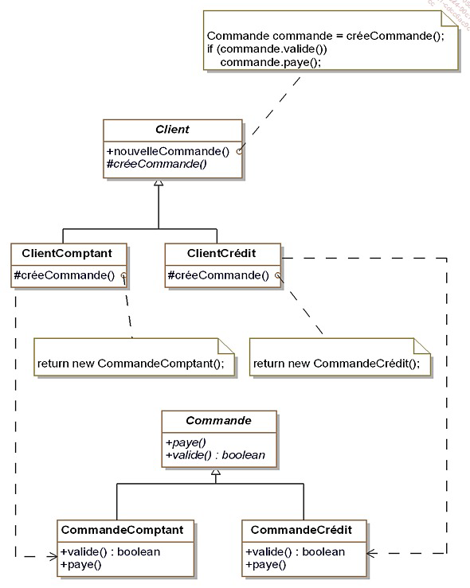


### Le pattern Singleton

Il faut s'asssurer de deux choses lorqu'on veut mettre en place ce pattern : 
 - une classe ne doit posseder qu'une seule instance
 - il faut fournir une methode de classe qui permet de fournir cette instance unique

 ### Le pattern Prototype

 Le but de ce pattern est de creer de nouveauz objects en dupliquant des objets existants appeles "prototypes".
 Ces derniers disposent d'une capacite de clonage

 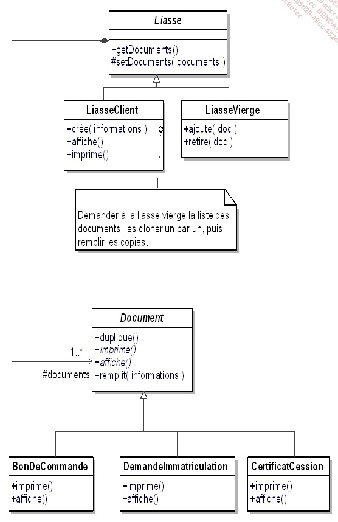

 ## Introduction aux patterns de structuration

 "L’objectif des patterns de structuration est de faciliter l’indépendance de l’interface d’un objet ou d’un
ensemble d’objets vis-à-vis de son implantation. Dans le cas d’un ensemble d’objets, il s’agit aussi de
rendre cette interface indépendante de la hiérarchie des classes et de la composition des objets.
En fournissant les interfaces, les patterns de structuration encapsulent la composition des objets,
augmentant le niveau d’abstraction du système à l’image des patterns de création qui encapsulent la
création des objets. Les patterns de structuration mettent en avant les interfaces.
L’encapsulation de la composition est réalisée non pas en structurant l’objet lui-même mais en transférant
cette structuration à un second objet. Celui-ci est intimement lié au premier objet. Ce transfert de
structuration signifie que le premier objet détient l’interface vis-à-vis des clients et gère la relation avec le
second objet qui lui gère la composition et n’a aucune interface avec les clients externes."


### Le pattern Adapter

Le but ici est d'adapter l'interface d'une classe donnee afin qu'elle puissent interagir avec un client.

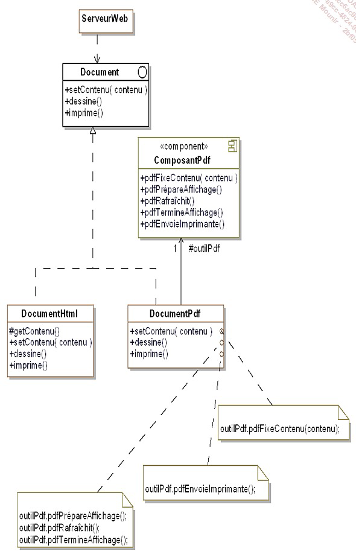


### Le pattern Decorator

Ici, on cherche a ajouter des fonctionnalites supp a un objet en prenant soin de ne pas modifier son interface. Toutes modifications apportees par ce pattern seront transparentes vis-a-vis des clients 

Ce pattern constitue une alternative a la creation de sous classe pour enrichir les fonctionnalites d'un objet.

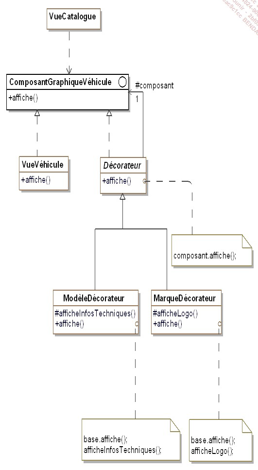


Le pattern Decorator peut etre utilise dans les domaines suivants: 
 - notre application souhaite ajouter dynamiquement des fonctionnalites a un objet sans modifier son interface, autrement dit sans avoir a modifier les clients de cet objet
 - une application doit gerer des fonctionnalites qui peuvent etre retirees dynamiquement 
 - l'utilisation de l'heritage n'est pas une option car la hierarchie d'objets est deja trop complexe.

 ### Le pattern Bridge

 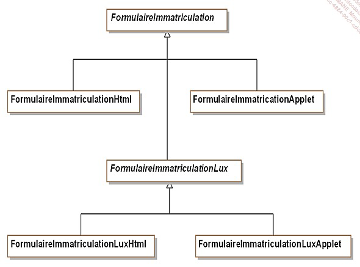

 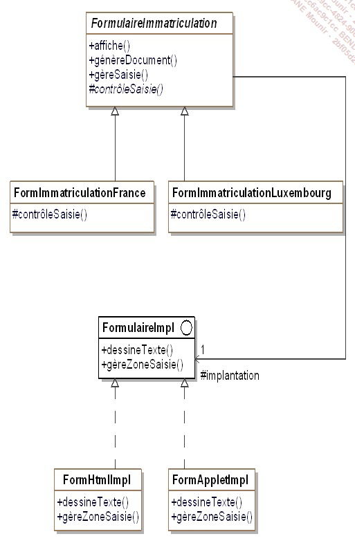


### Le pattern Composite 

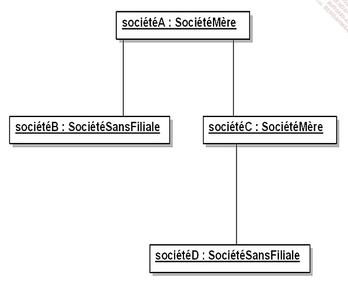


```
Au sein de notre système de vente de véhicules, nous voulons représenter les sociétés clientes,
notamment pour connaître le nombre de véhicules dont elles disposent et leur proposer des offres de
maintenance de leur parc.
Les sociétés qui possèdent des filiales demandent des offres de maintenance qui prennent en compte le
parc de véhicules de leurs filiales.
Une solution immédiate consiste à traiter différemment les sociétés sans filiale et celles possédant des
filiales. Cependant cette différence de traitement entre les deux types de société rend l’application plus
complexe et dépendante de la composition interne des sociétés clientes.
Le pattern résout ce problème en unifiant l’interface des deux types de sociétés et en
utilisant la composition récursive. Cette composition récursive est nécessaire car une société peut
posséder des filiales qui possèdent elles-mêmes d’autres filiales.
```


## Les patterns de comportement 

TODO: Ajouter la definition generale des patterns de comportement

### Le pattern chain of responsability

Ce pattern est utilise lorsque: 
 - une chaine d'objets gere une requete selon un ordre defini de facon dynamique
 - Ce mecanisme doit etre transparent vis-a-vis des clients de la chaine d'objets.

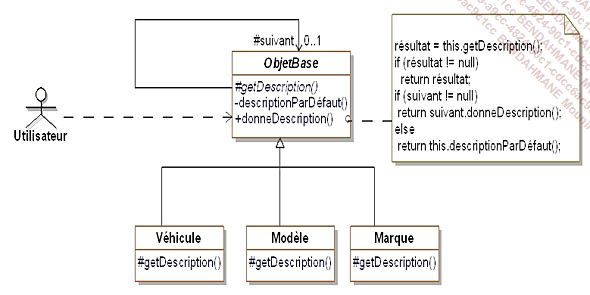

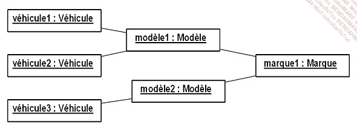

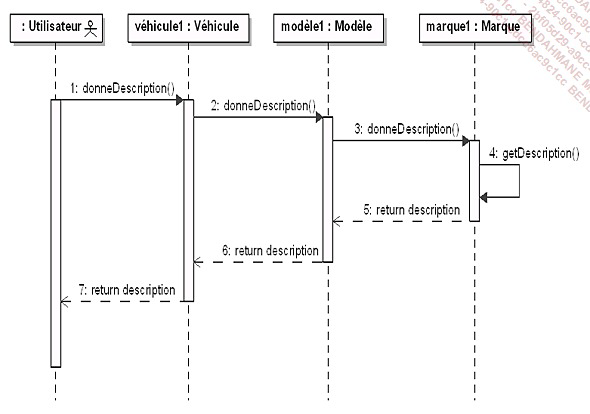


### Le pattern Command 

### Le pattern Iterator

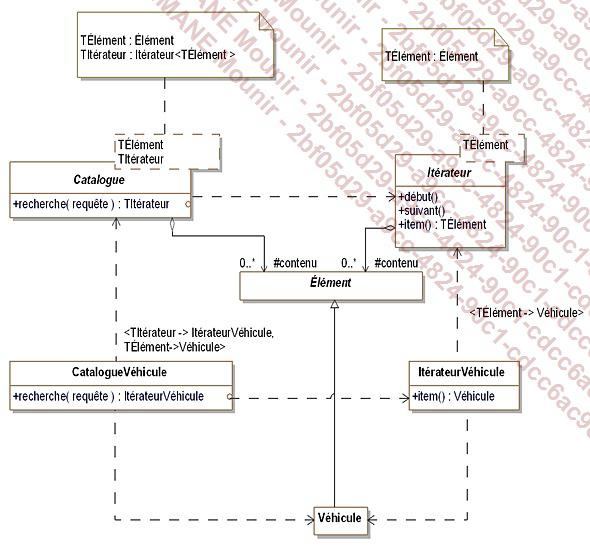

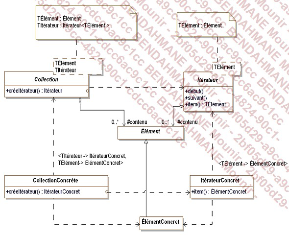